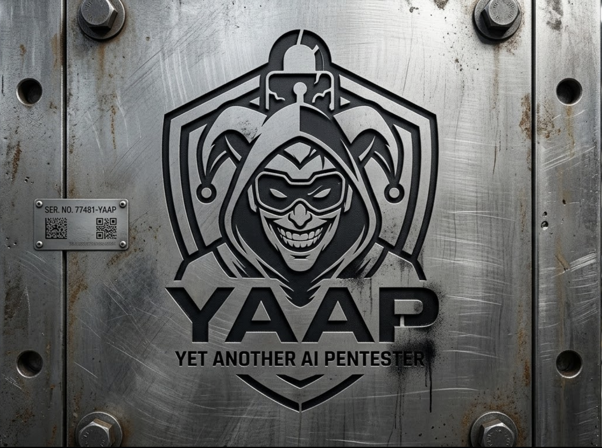

# YAAP - Yet Another AI Pentester



**AI-Powered Autonomous Web Application Security Testing Framework**

YAAP is a LangGraph-based multi-agent penetration testing system that autonomously discovers, analyzes, and exploits web vulnerabilities using AI-driven orchestration.

## Quick Start

### Installation
```bash
cd /Users/hs0bjh8/Desktop/Subhay/Study/yaap

# Install dependencies with uv
uv sync

# Install feroxbuster for endpoint discovery (required)
# AUTO-INSTALL: YAAP will auto-install feroxbuster if needed using:
# 1. Git clone + Cargo build (PRIMARY method - works everywhere)
# 2. Package managers (fallback - brew/apt/dnf)

# OR install manually:

# PRIMARY METHOD - Git Clone + Build (Recommended - works on macOS/Linux/Windows):
git clone https://github.com/epi052/feroxbuster.git
cd feroxbuster
cargo build --release
sudo cp target/release/feroxbuster /usr/local/bin/feroxbuster
sudo chmod +x /usr/local/bin/feroxbuster

# ALTERNATIVE - Homebrew (macOS):
brew install feroxbuster

# ALTERNATIVE - Package Manager (Linux):
# Ubuntu/Debian:
sudo apt install feroxbuster

# Fedora/RHEL:
sudo dnf install feroxbuster

# FALLBACK TOOL - Katana (if feroxbuster fails):
CGO_ENABLED=1 go install github.com/projectdiscovery/katana/cmd/katana@latest

# LAST RESORT TOOL - dirb:
# Ubuntu/Debian:
sudo apt-get install -y dirb

# SecLists wordlist for dirb (git clone):
git clone https://github.com/danielmiessler/SecLists.git /tmp/SecLists
# Example:
dirb http://target.com /tmp/SecLists/Discovery/Web-Content/common.txt

# Install SecLists wordlists for better directory bruteforcing (optional but recommended)
# macOS:
brew install seclists

# Linux:
sudo apt install seclists

# Verify installation
uv run pytest tests/test_vulnerability_testers.py -v
```

### Auto-Installation

YAAP automatically detects and installs missing tools:

**feroxbuster Auto-Install Process:**
1. Checks if feroxbuster is already in PATH
2. Detects operating system (macOS/Linux/Windows)
3. **PRIMARY**: Attempts git clone + Cargo build
   - Clones GitHub repo to `/tmp/feroxbuster-build`
   - Builds with cargo (takes 2-5 minutes)
   - Binary available immediately for testing
4. **FALLBACK**: Uses OS package managers
   - macOS: Homebrew (`brew install feroxbuster`)
   - Linux: apt-get or dnf
   - Windows: Cargo install
5. **TOOL FALLBACK**: If feroxbuster install/run fails, YAAP uses Katana
  - Auto-installs with Go:
    - `CGO_ENABLED=1 go install github.com/projectdiscovery/katana/cmd/katana@latest`
  - Runs katana endpoint discovery and converts output to YAAP endpoint format
6. **LAST RESORT**: If katana also fails, YAAP uses dirb
  - Attempts dirb installation (`apt-get`/`dnf`/`brew` depending on OS)
  - Clones SecLists via git:
    - `git clone https://github.com/danielmiessler/SecLists.git /tmp/SecLists`
  - Runs dirb with cloned SecLists wordlist
7. **AUTO-RECOVERY**: If Rust toolchain error occurs
   - Detects "Missing manifest in toolchain" error
   - Automatically runs `rustup update stable`
   - Retries build with updated toolchain
8. **CIRCUIT BREAKER**: If all methods fail
   - Stops execution immediately (halts assessment)
   - Provides clear error message and manual install instructions
   - Prevents wasted time on incomplete scans

**Requirements for auto-installation:**
- `git` - for cloning repository
- `cargo` - for building from source
- `go` - for katana fallback installation
- `dirb` - final fallback scanner (auto-installed where possible)
- `sudo` access - for system-wide installation (optional)

**Circuit Breaker Protection:**
```
❌ Installation fails → Circuit breaker activates
    → Assessment stops immediately
    → Error message: "Cannot proceed without endpoint discovery"
    → User must install feroxbuster manually before retry
```

**Example Auto-Recovery Output (Rust Toolchain Issue):**
```
[!] Build failed
Error: error: Missing manifest in toolchain 'stable-x86_64-unknown-linux-gnu'

[*] Detected Rust toolchain issue - attempting recovery...
[*] Running: rustup update stable

[+] Rust updated, retrying build...
[+] Build completed successfully after recovery!
[+] feroxbuster binary found at: /tmp/feroxbuster-build/target/release/feroxbuster
```

**Example Successful Installation Output:**
```
[*] feroxbuster not found in PATH
[*] Detecting operating system...
[*] Operating System: Linux
[*] PRIMARY METHOD: Git clone + Cargo build
[*] Both git and cargo available - proceeding
[*] Cloning feroxbuster from GitHub...
[+] Repository cloned successfully
[*] Building feroxbuster with Cargo...
[*] This may take 2-5 minutes...
[+] Build completed successfully!
[+] feroxbuster binary found at: /tmp/feroxbuster-build/target/release/feroxbuster
```

**Example Circuit Breaker Output (Installation Failed):**
```
[!] feroxbuster not found in PATH
[*] Attempting auto-installation...
[*] PRIMARY METHOD: Git clone + Cargo build...
[!] Git/Cargo not available
[*] FALLBACK: Linux - attempting package manager installation...
[!] Package managers failed

❌ CIRCUIT BREAKER ACTIVATED: feroxbuster installation failed

[!] Cannot proceed without endpoint discovery - assessment HALTED
[*] feroxbuster is REQUIRED for endpoint discovery

[*] Manual installation options:
    macOS:     brew install feroxbuster
    Linux:     cargo install feroxbuster (after installing Rust)
    Manual:    https://github.com/epi052/feroxbuster
```

### Set Up API Key
```bash
# Create .env file with your API key
echo "ANTHROPIC_API_KEY=<your-key>" > .env
```

### Run Assessment
```bash
# Full security assessment (with intelligent endpoint discovery)
uv run yaap.py -M claude-3-5-sonnet-latest -H http://target.com -P anthropic -T all

# Reconnaissance only
uv run yaap.py -M claude-3-5-sonnet-latest -H http://target.com -P anthropic -T recon

# Vulnerability hunting only
uv run yaap.py -M claude-3-5-sonnet-latest -H http://target.com -P anthropic -T hunt
```

### Intelligent Endpoint Discovery

YAAP now performs **intelligent reconnaissance** before attacking:

**Traditional (Bad) Approach:**
```
User provides: example.com
Framework blindly attacks: example.com/?1=1 (no such parameter!)
Result: Wasted time, no vulnerabilities found
```

**YAAP's Smart Approach:**
```
Step 1: User provides example.com
Step 2: feroxbuster discovers 25 real endpoints:
        - example.com/api/search
        - example.com/user/profile
        - example.com/admin/panel
Step 3: Scout analyzes endpoints for injection points:
        - /api/search has 'q' parameter ✓ (injectable)
        - /user/profile has 'id' parameter ✓ (injectable)
        - /admin/panel is form-based ✓ (injectable)
Step 4: Injector attacks ONLY identified injection points:
        - Test: example.com/api/search?q=[PAYLOAD] ✓
        - Test: example.com/user/profile?id=[PAYLOAD] ✓
        - Test: /admin/panel form fields ✓
Result: Efficient, targeted testing with real vulnerability discovery
```

**Workflow:**
1. **Discovery Phase (feroxbuster):**
   - Scans target for directories, files, and endpoints
   - Identifies valid URLs that actually exist
   - Detects HTTP status codes (200, 401, 403, etc.)

2. **Validation Phase (Scout):**
   - Analyzes discovered endpoints
   - Identifies which ones have parameters/forms
   - Classifies injection likelihood (high/medium/low)
   - Extracts parameter names for targeting

3. **Injection Phase (Injector):**
   - Only attacks endpoints with identified injection points
   - Tests each parameter with appropriate payloads
   - Uses session data for authenticated endpoints
   - Runs verified exploitation tools (sqlmap, xss-payloads, etc.)

**Result:** Significantly faster, more accurate vulnerability assessment with fewer false negatives.

### Strict Endpoint Validation (No Assumptions)

YAAP enforces **strict validation at every layer** to prevent testing non-existent endpoints or parameters:

**Validation Layers:**
1. **feroxbuster Discovery** - Only endpoints discovered by feroxbuster are added to whitelist
2. **Form Validation** - Only forms with injectable fields are extracted
3. **Parameter Validation** - Only test parameters actually found in validated forms
4. **Scout Validation** - `validate_inputs_against_feroxbuster()` rejects non-discovered endpoints
5. **Checklist Enforcement** - Prefers discovered + validated inputs; falls back to limited heuristic testing when none are found
6. **Injector Verification** - Validates target URL is in feroxbuster whitelist before testing

**NO BLIND ASSUMPTIONS:**
```
❌ WRONG: Endpoint /search exists → assume it has ?q parameter → test ?q=payload
❌ WRONG: Word "q" appears in response → add ?q to all endpoints → test blindly

✅ CORRECT: Endpoint / exists → fetch HTML → find form → validate form has fields
         → extract field names from validated form → test ONLY those fields
```

**Error Example:**
```
feroxbuster discovers:
  - https://xss-game.appspot.com/level1/ (200)

Scout fetches HTML:
  - No forms found
  - No query strings in URL

Result:
  ✓ Endpoint validated
  ✓ No injectable inputs found
  ⚠ Continues with limited, controlled heuristic testing (does not circuit-break)
```

**Why This Matters:**
- Prevents testing non-existent endpoints like `?q=payload` on URLs without parameters
- Reduces false negatives from testing only real attack surface
- Ensures testing is evidence-based, not theoretical
- Respects the actual application structure


### HTML Form Discovery and Analysis

YAAP automatically discovers and validates HTML forms on target endpoints:

**Form Discovery Features:**
- ✅ Automatic HTML form detection on discovered endpoints
- ✅ **Form validation** - only reports forms with injectable fields (no assumptions)
- ✅ **Field validation** - only tests fields that are actually injectable
- ✅ Form field extraction (text inputs, textareas, selects, hidden fields)
- ✅ Method detection (GET/POST/PUT/DELETE)
- ✅ Form action resolution (relative/absolute paths)
- ✅ Field type classification (text, password, hidden, checkbox, radio, select)
- ✅ Form submission testing with payload injection
- ✅ Response analysis (page changes, payload reflection, error indicators)

**No Assumptions Principle:**
```
❌ BAD: "Assume /search endpoint might have a form" → Test blindly
✅ GOOD: Fetch /search → Parse HTML → Validate form exists
       → Extract fields → Validate fields are injectable
       → THEN test with payloads
```

**Example Form Discovery:**
```
Scout discovers endpoint: http://target.com/search
    [VALIDATED] Fetched HTML: 1 form found
    [VALIDATED] Form has 'q' field (type: text) ✓ injectable
    [VALIDATED] Form has 'filter' field (type: select) ✓ injectable
    [SKIPPED] Form has 'submit' button (type: submit) ✗ not injectable

Injector only tests: 2 validated injectable fields
Result: POST /search with payload in validated 'q' field
```

**Validation Process:**
1. Discover endpoints via feroxbuster (actual endpoints only)
2. Fetch HTML from each endpoint (validate response)
3. Parse HTML for `<form>` tags (validate structure)
4. Extract form fields: `<input>`, `<textarea>`, `<select>` (validate presence)
5. Filter non-injectable fields: `hidden`, `submit`, `button` (validate injectability)
6. Only then test with payloads (on validated fields)

**Form Injection Works:**
1. Scout discovers endpoints via feroxbuster (100% real)
2. Form discovery validates each endpoint's HTML (not assumed)
3. Forms are extracted with field validation (only injectable fields)
4. Injector submits forms with payloads ONLY in validated target fields
5. Sets other fields to valid values (avoids form validation errors)
6. Response is analyzed for injection indicators:
   - Page content changes
   - Payload reflection in response
   - SQL/database errors
   - Status code changes
   - URL redirects

**Benefits:**
- Tests only forms that actually exist (not assumptions)
- Only injects into fields validated as injectable
- Tests actual form submissions (not just URL parameters)
- Detects POST-based vulnerabilities (not just GET)
- Reduces false positives from blind testing


### Authenticated Testing
For applications requiring authentication:

**Step 1: Configure Credentials** (`configs/credentials.json`):
```json
{
  "credentials": [
    {
      "site": "target.com",
      "id": "admin@target.com",
      "password": "SecurePassword123",
      "cookie": "",
      "bearer_token": "",
      "status": "active"
    }
  ]
}
```

**Step 2: Run Assessment with Authentication (use `--auth` flag)**:
```bash
# WITH --auth flag: Load credentials and attempt authentication
uv run yaap.py -M claude-3-5-sonnet-latest -H http://target.com -P anthropic -T all --auth

# WITHOUT --auth flag: Skip authentication (no login attempted)
uv run yaap.py -M claude-3-5-sonnet-latest -H http://target.com -P anthropic -T all
```

**When you use `--auth`**, YAAP will automatically:
1. Detect login forms during reconnaissance
2. Load credentials from `configs/credentials.json`
3. Attempt authentication (try saved cookie first, then id+password)
4. Save session cookies for reuse
5. Run ALL vulnerability tests in authenticated context

**When you DON'T use `--auth`:**
- Credentials are ignored
- No login attempts are made
- Only unauthenticated testing is performed

**Step 3: Verify Authenticated Testing**:
Look for logs indicating successful authentication:
```
[+] Authentication successful via form
[+] Using authenticated session (form)
[*] Session Available: True
```

If you see `[!][login_injector] Authentication disabled (use --auth flag to enable)`, then add the `--auth` flag to enable login.

**Bearer Token / API Testing**:
For API authentication (JWT, OAuth):
```json
{
  "credentials": [
    {
      "site": "api.target.com",
      "bearer_token": "eyJhbGciOiJIUzI1NiIsInR5cCI6IkpXVCJ9...",
      "status": "active"
    }
  ]
}
```

## Docker Deployment

### Build Docker Image
```bash
# Build the Docker image
docker build -t yaap:latest .

# Verify image was built
docker images | grep yaap
```

### Run with Docker (CLI)
```bash
# Basic execution
docker run --rm \
  -e ANTHROPIC_API_KEY=sk-ant-your-key-here \
  yaap:latest \
  uv run yaap.py -M claude-3-5-sonnet-latest \
  -H http://target.com \
  -P anthropic -T hunt

# With volume mount for reports
docker run --rm \
  -e ANTHROPIC_API_KEY=sk-ant-your-key-here \
  -v $(pwd)/reports:/yaap/reports \
  yaap:latest \
  uv run yaap.py -M claude-3-5-sonnet-latest \
  -H http://target.com \
  -P anthropic -T hunt

# Multiple targets
docker run --rm \
  -e ANTHROPIC_API_KEY=sk-ant-your-key-here \
  -v $(pwd)/reports:/yaap/reports \
  yaap:latest \
  uv run yaap.py -M claude-3-5-sonnet-latest \
  -H http://target1.com \
  -H http://target2.com \
  -P anthropic -T hunt
```

### Run with Docker Compose
```bash
# Set up environment
echo "ANTHROPIC_API_KEY=sk-ant-your-key-here" > .env
echo "TAVILY_API_KEY=your-tavily-key" >> .env

# Start YAAP container
docker-compose up

# Run security scan
docker-compose exec yaap \
  uv run yaap.py -M claude-3-5-sonnet-latest \
  -H http://target.com \
  -P anthropic -T hunt

# View logs
docker-compose logs -f yaap

# Stop container
docker-compose down
```

### Docker Compose Configuration
The `docker-compose.yml` includes:
- ✅ Automated image building
- ✅ Environment variable management  
- ✅ Volume mounts for `/reports` directory
- ✅ Resource limits (2 CPU, 2GB RAM)
- ✅ Health checks
- ✅ Security options (non-root user, read-only filesystem)
- ✅ Logging configuration

### Docker Environment Variables
```bash
# In docker-compose.yml or .env file:
ANTHROPIC_API_KEY=sk-ant-...      # Required for Claude
OPENAI_API_KEY=sk-...              # Optional: for GPT
GOOGLE_API_KEY=...                 # Optional: for Gemini
TAVILY_API_KEY=...                 # Optional: for web search
```

### Volume Mounting
```bash
# Mount reports directory (results saved to host)
-v $(pwd)/reports:/yaap/reports

# Mount custom tools (optional)
-v $(pwd)/custom_tools:/yaap/custom_tools:ro

# Mount configuration (optional)
-v $(pwd)/custom_config:/yaap/configs:ro
```

### Docker Network
```bash
# Run multiple containers on same network
docker network create yaap_network

# Run YAAP with network access
docker run --rm \
  --network yaap_network \
  -e ANTHROPIC_API_KEY=sk-ant-... \
  yaap:latest \
  uv run yaap.py -M claude-3-5-sonnet-latest \
  -H http://internal-app:8080 \
  -P anthropic -T hunt
```

### Working with Reports
```bash
# Run scan saving to mounted volume
docker run --rm \
  -e ANTHROPIC_API_KEY=sk-ant-... \
  -v $(pwd)/reports:/yaap/reports \
  yaap:latest \
  uv run yaap.py -M claude-3-5-sonnet-latest \
  -H http://target.com \
  -P anthropic -T hunt --csv_report

# View reports on host
ls -la reports/
cat reports/yaap_findings.csv
open reports/yaap_report.pdf  # macOS

# Export specific scan
docker cp container_id:/yaap/reports ./scan_results
```

### Docker Troubleshooting

**Issue: Permission denied**
```bash
# Solution: YAAP runs as non-root user (yaap:yaap)
# Ensure volume directories have proper permissions
chmod 777 ./reports
```

**Issue: Network connectivity**
```bash
# Solution: Add network setting for internal apps
docker run --rm \
  --network host \  # Access host network
  -e ANTHROPIC_API_KEY=sk-ant-... \
  yaap:latest \
  uv run yaap.py -M claude-3-5-sonnet-latest \
  -H http://localhost:8080 \
  -P anthropic -T hunt
```

**Issue: Timeout on large scans**
```bash
# Solution: Increase timeout
docker run --rm \
  -e ANTHROPIC_API_KEY=sk-ant-... \
  yaap:latest \
  uv run yaap.py -M claude-3-5-sonnet-latest \
  -H http://target.com \
  -P anthropic -T hunt \
  --default-timeout 300  # 5 minutes
```

**Issue: Memory limits**
```bash
# Solution: Increase container resources in docker-compose.yml
# Or use CLI flag:
docker run --rm \
  -m 4g \  # 4GB memory
  --cpus 4 \  # 4 CPU cores
  -e ANTHROPIC_API_KEY=sk-ant-... \
  yaap:latest \
  uv run yaap.py -M claude-3-5-sonnet-latest \
  -H http://target.com \
  -P anthropic -T hunt
```

### Production Deployment

**AWS EC2**
```bash
# SSH into EC2 instance
ssh -i key.pem ec2-user@instance.amazonaws.com

# Install Docker
curl -fsSL https://get.docker.com -o get-docker.sh
sudo bash get-docker.sh

# Build and run YAAP
git clone https://github.com/you/yaap.git
cd yaap
docker build -t yaap:latest .
docker run --rm \
  -e ANTHROPIC_API_KEY=sk-ant-... \
  -v $(pwd)/reports:/yaap/reports \
  yaap:latest \
  uv run yaap.py -M claude-3-5-sonnet-latest \
  -H http://internal-app.local \
  -P anthropic -T hunt
```

**Kubernetes/Helm** (Optional)
```bash
# Create deployment
kubectl create namespace security
kubectl apply -f - <<EOF
apiVersion: apps/v1
kind: Deployment
metadata:
  name: yaap
  namespace: security
spec:
  replicas: 1
  template:
    spec:
      containers:
      - name: yaap
        image: yaap:latest
        env:
        - name: ANTHROPIC_API_KEY
          valueFrom:
            secretKeyRef:
              name: yaap-secrets
              key: api-key
        volumeMounts:
        - name: reports
          mountPath: /yaap/reports
      volumes:
      - name: reports
        emptyDir: {}
EOF
```

## Vulnerability Coverage

### Authenticated Pentesting
✅ Login Detection (forms, redirect-based auth)
✅ Credential Management (automatic storage and reuse)
✅ Session Persistence (cookies, bearer tokens, JWT)
✅ Authenticated Vulnerability Testing (all payloads use active session)
✅ Auto-Credential-Retry (fallback to bruteforce if login fails)

### OWASP Top 10
✅ 1. Broken Access Control (IDOR, privilege escalation, access control bypass)
✅ 2. Cryptographic Failures (XXE - file read, DoS, blind XXE)
✅ 3. Injection (XSS, SQLi, Command, SSRF, NoSQL, LDAP, XPath - 80+ payloads)
✅ 4. Insecure Design (Business logic, authentication flaws)
✅ 5. SSRF (12+ payloads - localhost, AWS metadata, file://)
✅ 6. Vulnerable Components (CVE/version detection)
✅ 7. Authentication Failure (default credentials, weak auth, session fixation)
✅ 8. Data Integrity (CSRF, cache poisoning, response splitting)
✅ 9. Logging & Monitoring (Structured JSON logs)
✅ 10. Path Traversal (15+ encoding/bypass techniques, LFI, RFI)

### Web Security (Advanced)
✅ File Upload (unrestricted uploads, polyglots, null byte injection)
✅ File Inclusion (LFI, RFI, filter bypass, phar deserialization)
✅ Template Injection (8 template engines - Jinja2, Freemarker, Thymeleaf, etc.)
✅ CSRF & Session Security (token validation, fixation, cookie flags)
✅ CORS Misconfiguration (unauthorized origins, credential exposure)
✅ Security Headers (CSP, HSTS, X-Frame-Options, missing header detection)
✅ Cache Poisoning (cache key manipulation, sensitive content caching)
✅ HTTP Response Splitting (header injection, cookie injection)
✅ Host Header Injection (SSRF via header manipulation)
✅ Authentication Bypass (default credentials, weak tokens, broken auth patterns)
✅ Password Reset Flaws (weak tokens, reuse vulnerability)

### API Security (Top 10)
✅ GraphQL (introspection, query complexity DoS, authentication bypass)
✅ JWT (weak algorithms, sensitive claims exposure, signature bypass)
✅ Rate Limiting (enforcement detection, bypass techniques)
✅ Authentication Bypass (6 techniques)
✅ CORS & CSRF (misconfiguration testing)

## Testing Modes

### Recon Mode
Maps application structure, discovers inputs, identifies technologies.
```bash
uv run yaap.py -M <model> -H <target> -P anthropic -T recon
```

### Hunt Mode  
Directly tests vulnerabilities with specialized payloads.
```bash
uv run yaap.py -M <model> -H <target> -P anthropic -T hunt
```

### All Mode
Complete workflow: reconnaissance → vulnerability testing.
```bash
uv run yaap.py -M <model> -H <target> -P anthropic -T all
```

## PDF Report Generation

YAAP automatically generates professional A4 PDF reports with findings and evidence:

- ✅ ASCII-safe text rendering (compatible with standard fonts)
- ✅ Professional formatting with color-coded sections
- ✅ Vulnerability details with evidence
- ✅ Executive summary
- ✅ Remediation recommendations
- ✅ Confidentiality notice

Reports are saved to `artifacts/report_*.pdf`

## LLM Providers

### Anthropic Claude (Recommended)
```bash
export ANTHROPIC_API_KEY="sk-ant-..."
uv run yaap.py -M claude-3-5-sonnet-latest -H <target> -P anthropic
```

**⚠️ Valid Model Names**: Use model aliases to ensure compatibility:
- `claude-3-5-sonnet-latest` (recommended - auto-updates to newest)
- `claude-3-5-haiku-latest` (faster, cheaper)
- `claude-3-opus-latest` (most capable)

Do NOT use specific dates like `claude-3-5-sonnet-20241022` - these become unavailable. Always use `-latest` aliases.

### OpenAI GPT
```bash
export OPENAI_API_KEY="sk-..."
uv run yaap.py -M gpt-4o -H <target> -P openai
```

### Google Gemini
```bash
export GOOGLE_API_KEY="..."
uv run yaap.py -M gemini-1.5-flash -H <target> -P gemini
```

### Local Ollama
```bash
# Start Ollama: ollama run llama2 (or any available model)
uv run yaap.py -M llama2 -H <target> -P ollama
```

## Available Tools

All tools are available as LLM callable functions:

**Injection Testing** (XSS, SQLi, Command, SSRF, Path Traversal, XXE, NoSQL, LDAP, XPath):
- `test_xss_payloads` - XSS vulnerability detection (30+ payloads)
- `test_sqli` - SQL injection testing (sqlmap integration)
- `test_command_injection` - OS command injection (shell metacharacters)
- `test_ssrf_payloads` - Server-side request forgery (AWS, localhost, file://)
- `test_path_traversal` - Path traversal attacks (../.. encoding variants)
- `test_xxe_injection` - XML external entity attacks (file read, blind, DoS)
- `test_idor_vulnerabilities` - ID enumeration attacks
- `test_idor_with_uuid` - UUID pattern enumeration
- `test_nosql_injection` - MongoDB, CouchDB injection ($or, $regex, $where)
- `test_ldap_injection` - LDAP filter injection
- `test_xpath_injection` - XPath injection attacks
- `test_ssti_injection` - Server-side template injection (8 engines)

**Endpoint Discovery & Reconnaissance**:
- `discover_directories_feroxbuster` - Directory/endpoint discovery via feroxbuster
- `identify_injection_points` - Identify attack targets in discovered endpoints
- `discover_forms` - Extract HTML forms from endpoints
- `test_form_injection` - Inject payloads into form fields
- `inject_into_form` - Advanced form-aware payload injection
- `inject_into_parameter` - Parameter-based payload injection
- `analyze_injection_result` - Determine injection success likelihood

**Web Security - File Upload/Inclusion**:
- `test_unrestricted_file_upload` - Unrestricted file uploads (7 payload types)
- `test_file_inclusion` - Local file inclusion (LFI) with filter bypass
- `test_remote_file_inclusion` - Remote file inclusion (RFI) exploitation
- `test_phar_deserialization` - PHP object deserialization via phar://

**Web Security - Authentication & Access Control**:
- `test_default_credentials` - Default/weak credential testing (10+ common creds)
- `test_broken_authentication` - Authentication pattern flaws (no auth, weak tokens)
- `test_privilege_escalation` - Vertical privilege escalation
- `test_access_control_bypass` - Horizontal privilege escalation & IDOR
- `test_password_reset_flaws` - Weak reset token validation & reuse

**Web Security - CORS, Headers, & HTTP**:
- `test_cors_misconfiguration` - CORS authorization bypass
- `test_missing_security_headers` - Missing security headers detection
- `test_cache_poisoning` - Cache key manipulation & poisoning
- `test_http_response_splitting` - HTTP header injection
- `test_host_header_injection` - Host header manipulation

**API Testing**:
- `test_graphql_security` - GraphQL schema/DoS attacks
- `test_jwt_security` - JWT validation & bypass
- `test_api_rate_limiting` - Rate limit detection
- `test_api_authentication_bypass` - API authentication bypass methods

**Infrastructure Testing**:
- `test_tls_ssl_security` - TLS/SSL configuration analysis
- `enumerate_subdomains` - Subdomain discovery (30+ patterns)
- `detect_waf` - WAF fingerprinting
- `test_server_misconfiguration` - Exposed paths & misconfigured endpoints
- `test_security_headers` - Comprehensive security header analysis

**Utility Tools**:
- `research` - Web-based vulnerability research via Tavily
- `execute` - Command execution for reconnaissance

## Agent System

The framework uses 14+ specialized AI agents:
- **Scout**: Application mapping (URLs, forms, inputs)
- **Researcher**: Technology identification & CVE lookup
- **Arsenal**: Tool/command selection from YAML config
- **Validator**: Input classification & routing
- **Login Injector**: Authentication form testing
- **Bruteforce**: Credential discovery
- **Checklist**: Testing orchestration & iteration
- **Injector**: Payload delivery & exploitation
- **Observer**: Response analysis & verification
- **Modifier**: Payload transformation for WAF bypass
- **Encoder**: Multi-layer encoding (Base64, URL, Unicode, etc.)
- **Reporter**: PDF report generation with evidence

## Configuration

### Environment Variables
```bash
# Required for remote LLMs
ANTHROPIC_API_KEY=sk-ant-...
OPENAI_API_KEY=sk-...
GOOGLE_API_KEY=...

# Optional
TAVILY_API_KEY=...  # For web search (research tool)
```

### Command Line Options
```bash
-M, --model MODEL          LLM model name (required)
-H, --host HOST           Target URL (required)
-T, --test MODE           Testing mode: recon | hunt | all (default: recon)
-P, --provider PROVIDER   LLM provider: anthropic | openai | gemini | ollama
--max-commands N          Maximum commands to execute
--dry-run                 Plan only, don't execute
--default-timeout N       Tool timeout in seconds (default: 90)
--ensure-basics           Run baseline header probe
--auto-install            Auto-install missing tools
--auth                    Attempt authentication using configs/credentials.json
--no-report              Skip PDF report generation
--csv_report             Generate CSV report
```

### Authentication Flag
The `--auth` flag enables authenticated testing:

```bash
# WITH authentication - Load and use credentials from configs/credentials.json
uv run yaap.py -M claude-3-5-sonnet-latest -H http://target.com -P anthropic -T all --auth

# WITHOUT authentication - Skip login (default behavior)
uv run yaap.py -M claude-3-5-sonnet-latest -H http://target.com -P anthropic -T all
```

**Important**: Use `--auth` ONLY if your target requires authentication and you have credentials configured in `configs/credentials.json`. Without this flag, login attempts are skipped entirely.

## Testing

Run the test suite:
```bash
# All tests
uv run pytest tests/ -v

# Specific test category
uv run pytest tests/test_vulnerability_testers.py::TestOWASPTester -v

# With coverage
uv run pytest tests/ --cov=tools --cov=agents
```

## CLI Reference

| Flag | Description |
|------|-------------|
| `-M, --model` | Model name (required) |
| `-H, --host` | Target URL (required) |
| `-T, --test` | Test mode: `recon`, `hunt`, or `all` (default: recon) |
| `-P, --provider` | LLM provider: `anthropic`, `openai`, `gemini`, `ollama` |
| `--csv_report` | Generate CSV summary report |
| `--no-report` | Disable PDF report generation |
| `--max-commands` | Limit number of tools to execute |
| `--default-timeout` | Tool execution timeout in seconds |
| `--dry-run` | Plan without executing tools |
| `--auto-install` | Auto-install missing tools (requires sudo) |

## Requirements

- **OS**: Linux, macOS, Windows
- **Python**: >= 3.10
- **LLM**: Ollama (local) or API keys (remote providers)

## Security & Privacy

- **Local-first**: Run with Ollama for complete privacy
- **Evidence-based**: Reports grounded in actual tool output
- **Trace logging**: Complete audit trail of all actions

## License

MIT License - see `LICENSE.md` for details

---

**⚠️ Legal Disclaimer**: Use only on systems you own or have explicit permission to test. Unauthorized security testing is illegal.

